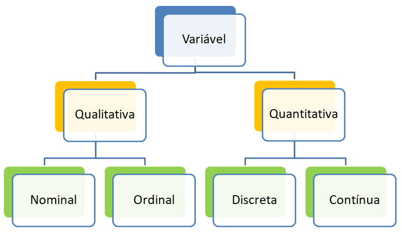

# Fundamentos

::: {.callout-tip title="Pergunta para começar"}
Em uma universidade, milhares de informações são registradas diariamente: notas, matrículas, frequência, solicitações, tempo de conclusão do curso, participação em projetos e motivos de evasão. **Em que momento esses registros deixam de ser apenas dados e passam a sustentar uma decisão?**
:::

## Apresentação e discussão do Plano de Ensino

## O que é Estatística?

A Estatística é a ciência que desenvolve e utiliza métodos para **obter, organizar, resumir, analisar e interpretar dados**, levando em consideração a variabilidade e a incerteza presentes nos fenômenos estudados.

Essa definição é mais ampla do que a ideia de “fazer contas”. Uma análise estatística adequada envolve:

- formular uma pergunta clara;
- definir o que será observado;
- planejar como os dados serão obtidos;
- avaliar a qualidade dos registros;
- escolher métodos compatíveis com as variáveis;
- interpretar os resultados no contexto;
- comunicar conclusões e limitações.

Bussab e Morettin destacam a organização, a descrição e a interpretação de conjuntos de dados como componentes fundamentais da formação estatística. Witte e Witte, assim como Murteira e colaboradores, também enfatizam que os procedimentos estatísticos precisam ser relacionados ao problema que originou os dados.

### A variabilidade está no centro da Estatística

Considere três situações:

- estudantes que dedicam o mesmo número de horas aos estudos podem obter notas diferentes;
- pacientes submetidos ao mesmo tratamento podem apresentar respostas diferentes;
- municípios com populações semelhantes podem ter indicadores sociais distintos.

A Estatística existe porque os fenômenos apresentam variação. Se todas as observações fossem sempre iguais, bastaria observar um único caso.

::: {.callout-note title="Variabilidade não é sinônimo de erro"}
Parte da variabilidade pode resultar de erros de medição ou registro, mas grande parte é uma característica real dos indivíduos, grupos, processos e ambientes.
:::

## Dados, informação e evidência

Um banco de dados não é, por si só, uma conclusão. Os valores registrados precisam ser contextualizados, verificados, organizados e interpretados.

```{mermaid}
flowchart LR
  A[Dados registrados] --> B[Verificação da qualidade]
  B --> C[Organização]
  C --> D[Resumo e visualização]
  D --> E[Informação contextualizada]
  E --> F[Evidência para uma decisão]
```

- **Dados:** registros obtidos sobre pessoas, objetos, eventos ou processos.
- **Informação:** dados organizados de modo a responder uma pergunta.
- **Evidência:** informação avaliada à luz da qualidade dos dados, do planejamento do estudo e das limitações da análise.

### Exemplo

A afirmação “a média foi 7,2” é insuficiente. Precisamos perguntar:

- média de qual variável?
- calculada para quais indivíduos?
- em qual período?
- houve valores ausentes?
- a média representa adequadamente a distribuição?
- o grupo observado corresponde à população de interesse?

::: {.callout-warning title="Cálculo correto, conclusão errada"}
Uma média pode estar numericamente correta e, mesmo assim, sustentar uma conclusão inadequada quando a amostra é seletiva, a variável foi mal definida ou os dados apresentam erros não identificados.
:::

## Estatística Descritiva

A **Estatística Descritiva** reúne métodos utilizados para organizar, resumir e apresentar os dados observados. Entre seus principais recursos estão:

- tabelas de frequências;
- gráficos;
- medidas de tendência central;
- medidas de posição;
- medidas de dispersão;
- medidas de forma;
- medidas de associação.

### Exemplo de pergunta descritiva

> Qual foi a distribuição das notas dos estudantes matriculados em uma turma específica?

A resposta descreve os estudantes daquela turma. Não é necessário, nesse momento, generalizar o resultado para todos os estudantes da universidade.

## Análise Exploratória de Dados

A **Análise Exploratória de Dados**, frequentemente abreviada como AED, é uma abordagem investigativa que busca conhecer a estrutura dos dados antes de conclusões formais ou modelos mais complexos.

A AED procura responder perguntas como:

- quais valores são mais frequentes?
- como os dados se distribuem?
- existem observações muito diferentes das demais?
- há lacunas, concentrações ou agrupamentos?
- existem categorias duplicadas por diferenças de grafia?
- quais variáveis parecem estar relacionadas?
- a forma da distribuição sugere assimetria?
- há dados ausentes?
- os resultados mudam quando observações suspeitas são investigadas?

Hoaglin, Mosteller e Tukey apresentam a exploração como um processo de descoberta, diagnóstico e geração de novas perguntas. A análise não deve ficar limitada a uma única medida ou a um único gráfico.

::: {.callout-tip title="Atitude exploratória"}
A pergunta não é apenas “qual foi o resultado?”, mas também “como os dados foram obtidos?”, “o resultado é consistente?”, “há outra forma de visualizar?” e “o que ainda não conseguimos explicar?”.
:::

## Estatística Inferencial

A **Estatística Inferencial** utiliza dados de uma amostra para produzir conclusões sobre uma população, reconhecendo a incerteza envolvida nesse processo.

Entre os procedimentos inferenciais estão:

- estimação de parâmetros;
- intervalos de confiança;
- testes de hipóteses;
- modelos probabilísticos;
- modelos de regressão;
- métodos de predição.

### Exemplo de pergunta inferencial

> Com base em uma amostra de estudantes, qual é a proporção estimada de todos os estudantes da universidade que utiliza transporte coletivo?

Nesta disciplina, a prioridade será a descrição e a exploração. A inferência exige fundamentos probabilísticos e será aprofundada em componentes curriculares posteriores.

## Descrição, exploração e inferência: comparação

| Abordagem | Pergunta central | Exemplo |
|------------------------|------------------------|------------------------|
| Estatística Descritiva | O que ocorreu nos dados observados? | Qual foi a mediana das notas da turma? |
| Análise Exploratória | Que padrões, diferenças ou problemas aparecem nos dados? | Há assimetria, grupos ou valores incomuns nas notas? |
| Estatística Inferencial | O que os dados permitem concluir sobre uma população? | Qual é a média estimada das notas de todos os estudantes do curso? |

Essas abordagens não são rivais. Uma análise bem conduzida normalmente começa pela descrição e exploração e, quando o objetivo exige, avança para a inferência.

## Método científico e método estatístico

A Estatística não começa com uma tabela, um gráfico ou uma fórmula. Ela surge dentro de uma investigação motivada por uma **questão sobre algum fenômeno de interesse**. Os dados são produzidos ou obtidos porque existe algo que desejamos descrever, comparar, explicar, avaliar ou compreender.

Por isso, antes de estudar técnicas de análise de dados, é importante entender onde a Estatística se insere no processo mais amplo de produção do conhecimento.

### Método científico

O **método científico** pode ser entendido como um conjunto organizado de princípios e práticas utilizados para investigar fenômenos, produzir evidências e construir explicações ou conclusões que possam ser avaliadas criticamente [@gauch2002].

Isso não significa que toda investigação científica siga uma sequência rígida e universal de passos. Diferentes áreas utilizam estratégias distintas de investigação, e uma pesquisa pode retornar várias vezes a etapas anteriores. O elemento fundamental é que as conclusões sejam construídas de maneira **sistemática, fundamentada em evidências e aberta à revisão** [@gauch2002; @gower1997].

Considere uma situação simples.

Um professor observa que alguns estudantes chegam frequentemente atrasados às aulas. Essa observação pode despertar uma questão inicial:

> **O tempo de deslocamento até a universidade pode estar relacionado aos atrasos dos estudantes?**

A observação, por si só, não é suficiente para responder à pergunta. É necessário transformá-la em um problema investigável.

Poderíamos então perguntar:

- qual é o tempo de deslocamento dos estudantes?
- qual meio de transporte utilizam?
- quantos atrasos tiveram durante determinado período?
- estudantes com maiores tempos de deslocamento apresentam mais atrasos?

A partir dessas perguntas, é necessário decidir **quais evidências serão necessárias e como serão obtidas**.

De maneira simplificada, uma investigação científica pode ser compreendida a partir de três grandes momentos:

$$\text{Perguntar}
\quad \longrightarrow \quad
\text{Investigar}
\quad \longrightarrow \quad
\text{Concluir}.$$

Esses momentos envolvem atividades como:

1.  **identificar e formular o problema**;
2.  **definir perguntas ou hipóteses de investigação**;
3.  **planejar como obter evidências**;
4.  **observar, medir ou coletar informações**;
5.  **analisar as evidências obtidas**;
6.  **interpretar os resultados à luz do problema inicial**;
7.  **comunicar as conclusões e suas limitações**.

Entretanto, o processo não termina necessariamente na conclusão. Uma investigação pode revelar novas perguntas, limitações ou fenômenos que não haviam sido considerados inicialmente.

```{mermaid}
flowchart LR
    A["Observação ou problema"] --> B["Pergunta de investigação"]
    B --> C["Planejamento"]
    C --> D["Obtenção de evidências"]
    D --> E["Análise"]
    E --> F["Interpretação e conclusão"]
    F --> G["Comunicação"]
    G -.->|"Novas questões"| B
```

::: {.callout-note title="O método científico não é uma receita"}
A representação em etapas é útil para organizar o raciocínio, mas não deve ser interpretada como um roteiro rígido. Durante uma investigação, uma descoberta pode levar à reformulação da pergunta, à revisão das variáveis, à obtenção de novos dados ou à reconsideração de uma conclusão. A ciência é, portanto, um processo **iterativo e autocorretivo** [@gauch2002].
:::

Um aspecto fundamental desse processo é a relação entre **afirmações e evidências**. Uma conclusão científica deve ser compatível com as evidências disponíveis e com a forma pela qual essas evidências foram produzidas.

É justamente nesse ponto que a Estatística assume papel central em muitas investigações.

### Do método científico ao método estatístico

Quando as evidências são constituídas por **dados sujeitos à variabilidade**, surgem questões específicas:

- quem ou o que deve ser observado?
- quais características devem ser registradas?
- quantas observações serão necessárias?
- os dados representam adequadamente o fenômeno de interesse?
- existem erros ou informações ausentes?
- quais padrões aparecem nos dados?
- as diferenças observadas são relevantes?
- até onde os resultados podem ser generalizados?

A Estatística fornece conceitos e métodos para lidar com essas questões.

Assim, o **método estatístico** pode ser entendido como a parte da investigação dedicada ao **planejamento da obtenção dos dados, sua organização, análise e interpretação**.

Uma das representações mais conhecidas do processo de investigação estatística é o ciclo **PPDAC**, discutido por Wild e Pfannkuch [-@wild1999]:

$$\text{Problema}
\rightarrow
\text{Plano}
\rightarrow
\text{Dados}
\rightarrow
\text{Análise}
\rightarrow
\text{Conclusões}.$$

Cada etapa está relacionada à seguinte.

**Problema**

Tudo começa com uma pergunta. Antes de qualquer cálculo, precisamos saber **o que desejamos descobrir**.

**Plano**

Definimos como a investigação será conduzida: população, unidades observacionais, variáveis, fonte dos dados, forma de coleta e, quando necessário, procedimento de amostragem.

**Dados**

Os dados são obtidos e registrados. Nessa etapa também precisamos verificar sua estrutura e qualidade.

**Análise**

Os dados são organizados, resumidos, representados e analisados com métodos adequados ao problema.

**Conclusões**

Os resultados são interpretados no contexto da investigação e utilizados para responder à pergunta inicial.

O ciclo pode ser representado como:

```{mermaid}
flowchart LR
    A["Problema"] --> B["Plano"]
    B --> C["Dados"]
    C --> D["Análise"]
    D --> E["Conclusões"]
    E -.->|"Novas perguntas"| A
```

Para os objetivos desta disciplina, podemos detalhar esse processo da seguinte maneira:

1.  **Definição do problema**\
    Estabelecer claramente o que se deseja conhecer, descrever, comparar ou investigar.

2.  **Definição da população, das unidades e das variáveis**\
    Determinar sobre quem ou sobre o que serão produzidas as conclusões e quais características precisam ser observadas.

3.  **Planejamento da obtenção dos dados**\
    Definir a fonte dos dados, a forma de coleta, os instrumentos de registro e, quando necessário, o plano amostral.

4.  **Obtenção dos dados**\
    Coletar dados primários ou acessar dados secundários de acordo com o planejamento estabelecido.

5.  **Verificação da qualidade dos dados**\
    Examinar valores ausentes, erros de registro, duplicidades, inconsistências e outras situações que possam comprometer a análise.

6.  **Organização e exploração**\
    Estruturar os dados e utilizar tabelas, gráficos e medidas resumo para compreender sua distribuição e identificar padrões ou situações inesperadas.

7.  **Análise estatística**\
    Aplicar métodos adequados ao objetivo da investigação, à natureza das variáveis e à forma como os dados foram obtidos.

8.  **Interpretação**\
    Relacionar os resultados estatísticos ao problema original e ao contexto em que os dados foram produzidos.

9.  **Comunicação e documentação**\
    Apresentar métodos, resultados, conclusões, limitações e decisões tomadas durante a análise de forma clara e reprodutível.

```{mermaid}
flowchart LR
    A["Problema"] --> B["População e variáveis"]
    B --> C["Planejamento"]
    C --> D["Obtenção dos dados"]
    D --> E["Qualidade e organização"]
    E --> F["Exploração e análise"]
    F --> G["Interpretação"]
    G --> H["Comunicação"]
    H -.->|"Novas questões"| A
```

Observe que **a análise estatística não é o primeiro passo**. Antes de calcular qualquer medida ou construir qualquer gráfico, precisamos compreender o problema, a origem dos dados e o significado das variáveis.

Da mesma forma, o trabalho não termina quando o software produz um resultado. Esse resultado precisa ser interpretado à luz da pergunta que motivou a investigação.

### Onde entra a Análise Exploratória de Dados?

A **Análise Exploratória de Dados (AED)** ocupa uma posição central entre a obtenção dos dados e a interpretação dos resultados.

Tukey [-@tukey1977] enfatizou a importância de examinar os dados de maneira exploratória, utilizando representações gráficas, medidas resumo e outras ferramentas para revelar padrões, estruturas, relações e observações inesperadas.

A exploração permite perguntar aos próprios dados:

- quais valores são mais frequentes?
- onde os dados estão concentrados?
- existe grande variabilidade?
- há observações muito diferentes das demais?
- existem grupos distintos?
- duas variáveis parecem estar relacionadas?
- existe algum padrão que não havia sido previsto inicialmente?

Por essa razão, a AED não deve ser vista apenas como uma coleção de gráficos e medidas descritivas. Ela representa uma **forma de investigar os dados antes de formular conclusões definitivas**.

Podemos situá-la no processo da seguinte maneira:

```{mermaid}
flowchart LR
    A["Pergunta"] --> B["Planejamento"]
    B --> C["Dados"]
    C --> D["Organização"]
    D --> E["Análise Exploratória de Dados"]
    E --> F["Outras análises estatísticas"]
    F --> G["Interpretação"]
    G --> H["Conclusão"]

    E -.->|"novos padrões ou problemas"| A
```

A seta de retorno é particularmente importante. Durante a exploração, podemos descobrir que:

- determinada variável foi registrada incorretamente;
- existem valores ausentes em quantidade relevante;
- uma categoria precisa ser revisada;
- existem grupos que não haviam sido considerados;
- a pergunta inicial precisa ser refinada.

Portanto, a exploração também pode modificar o rumo da investigação.

### Como os processos se relacionam?

Podemos resumir a relação entre esses conceitos da seguinte forma:

| Processo | Pergunta principal |
|:-----------------------------------|:-----------------------------------|
| Método científico | Como investigar sistematicamente um fenômeno e produzir conhecimento fundamentado em evidências? |
| Método estatístico | Como obter, organizar, analisar e interpretar dados para responder a uma pergunta de investigação? |
| Análise Exploratória de Dados | O que os dados revelam sobre sua distribuição, estrutura, padrões e possíveis problemas? |

Assim, o método estatístico **não substitui o método científico**. Ele fornece princípios e ferramentas para a parte da investigação em que as evidências assumem a forma de dados [@wild1999].

Da mesma maneira, a Análise Exploratória de Dados não substitui todo o método estatístico. Ela corresponde a uma etapa fundamental de investigação dos dados e auxilia a orientar análises posteriores [@tukey1977].

::: {.callout-important title="Do problema à resposta"}
Uma análise de dados possui **início, meio e fim**.

**No início**, existe um problema ou uma pergunta e precisamos definir quais evidências serão necessárias.

**No meio**, os dados são obtidos, verificados, organizados, explorados e analisados.

**No fim**, os resultados são interpretados no contexto da investigação e utilizados para responder à pergunta inicial.

Entretanto, o fim de uma investigação pode representar o início de outra: **novas evidências frequentemente produzem novas perguntas**.
:::

> **Ideia-chave:** não analisamos dados simplesmente porque eles estão disponíveis. Analisamos dados porque existe uma pergunta que desejamos responder. O problema orienta a produção dos dados; os dados orientam a análise; e a análise deve retornar ao problema para produzir uma conclusão.

## Etapas de uma análise de dados

### Formular uma pergunta investigável

Perguntas muito amplas precisam ser transformadas em perguntas que possam ser examinadas com dados.

**Pergunta ampla:**

> Os estudantes estão satisfeitos com o curso?

**Perguntas investigáveis:**

- qual é a distribuição do nível de satisfação?
- a satisfação difere entre períodos do curso?
- quais aspectos recebem as menores avaliações?
- existe associação entre satisfação e intenção de permanecer no curso?

### Definir as unidades observacionais

Precisamos indicar sobre quem ou sobre o que os dados serão registrados.

### Definir as variáveis

Cada conceito precisa ser traduzido em uma forma de registro. “Desempenho”, por exemplo, pode ser representado por nota, média no período, aprovação, quantidade de reprovações ou tempo para concluir uma disciplina. Essas medidas não são equivalentes.

### Obter os dados

Os dados podem ser obtidos por questionários, experimentos, observações, sensores, registros administrativos, entrevistas ou bases já existentes.

### Verificar a qualidade

Devem ser investigados:

- valores ausentes;
- duplicidades;
- unidades incorretas;
- categorias inconsistentes;
- valores impossíveis;
- erros de digitação;
- alterações não documentadas.

### Explorar e interpretar

A exploração combina tabelas, gráficos e medidas resumo. Nenhum resultado deve ser interpretado fora do contexto.

### Comunicar

Uma análise deve ser compreensível e verificável. É necessário indicar a fonte, explicar as variáveis, apresentar resultados relevantes e registrar as limitações.

## População

A **população estatística** é o conjunto de unidades sobre as quais se deseja obter informação em uma investigação.

As unidades podem ser:

- pessoas;
- domicílios;
- empresas;
- municípios;
- animais;
- produtos;
- atendimentos;
- transações;
- medições;
- eventos;
- períodos de tempo.

### Exemplos

| Pergunta | População |
|------------------------------------|------------------------------------|
| Qual é a idade dos estudantes do curso? | Todos os estudantes do curso no período definido |
| Qual é o tempo de atendimento de uma unidade de saúde? | Todos os atendimentos realizados no período de interesse |
| Qual é a taxa de defeitos de uma linha de produção? | Todos os itens produzidos no intervalo definido |
| Como variou a precipitação em Manaus? | Registros de precipitação do local e período definidos |

::: {.callout-important title="A população precisa ser delimitada"}
“Estudantes universitários” não define completamente uma população. É necessário indicar instituição, curso, campus, período e critérios de inclusão, conforme o objetivo da pesquisa.
:::

### População finita

Uma população é finita quando possui uma quantidade limitada de unidades no domínio considerado.

**Exemplo:** todos os estudantes regularmente matriculados em determinado curso no semestre 2026/2.

### População conceitualmente infinita

Em alguns problemas, a população é formada por resultados possíveis de um processo que pode continuar produzindo observações.

**Exemplos:**

- medições futuras de uma máquina operando nas mesmas condições;
- resultados de sucessivos lançamentos de um dado;
- tempos de espera gerados continuamente por um serviço.

Na prática, populações extremamente grandes também podem ser tratadas, para determinados cálculos, como se fossem infinitas. Essa aproximação depende do problema e do método utilizado.

## Censo

Um **censo** ocorre quando se procura observar todas as unidades da população definida.

### Vantagens possíveis

- cobertura completa da população-alvo;
- possibilidade de produzir resultados para subgrupos pequenos;
- ausência de erro amostral, quando todas as unidades são efetivamente observadas.

### Limitações

- custo elevado;
- maior tempo de execução;
- dificuldade operacional;
- recusas e não respostas;
- erros de medição ou registro;
- necessidade de atualização periódica.

::: {.callout-warning title="Censo não significa ausência de erro"}
Mesmo quando todas as unidades são pesquisadas, podem ocorrer erros de cobertura, resposta, registro, processamento e interpretação.
:::

## Amostra

Uma **amostra** é um subconjunto da população selecionado para observação.

A amostra pode ser utilizada quando:

- o censo é caro ou demorado;
- a população é muito grande;
- a avaliação destrói ou modifica a unidade observada;
- os resultados precisam ser produzidos rapidamente;
- existe um plano de amostragem capaz de fornecer informação adequada.

### Exemplo

- **População:** todos os estudantes de graduação de uma universidade.
- **Amostra:** 600 estudantes selecionados segundo um plano previamente definido.
- **Objetivo:** investigar hábitos de estudo e condições de permanência.

A qualidade da conclusão não depende apenas do tamanho da amostra. Também depende de **como** as unidades foram selecionadas, da taxa de resposta e da qualidade da medição.

### Censo e amostra: comparação

| Aspecto | Censo | Amostra |
|------------------------|------------------------|------------------------|
| Unidades observadas | Todas as unidades da população definida | Parte das unidades |
| Custo | Geralmente maior | Geralmente menor |
| Tempo | Geralmente maior | Geralmente menor |
| Erro amostral | Não existe | Existe |
| Outros erros | Podem ocorrer | Podem ocorrer |
| Atualização | Pode ser difícil | Pode ser mais rápida |

## Unidade observacional

A **unidade observacional** é o elemento sobre o qual as variáveis são registradas.

### Exemplos

- em uma pesquisa com estudantes, a unidade observacional pode ser cada estudante;
- em um estudo sobre domicílios, pode ser cada domicílio;
- em uma análise de atendimentos, pode ser cada atendimento;
- em um estudo longitudinal, pode ser cada combinação entre pessoa e momento;
- em uma análise de vendas, pode ser cada transação ou cada item vendido.

::: {.callout-note title="Uma linha nem sempre corresponde a uma pessoa"}
Em um banco de dados, uma pessoa pode aparecer várias vezes quando existem medidas repetidas, diferentes consultas ou vários eventos associados a ela. A unidade observacional precisa ser definida antes da análise.
:::

### Unidade amostral e unidade de análise

Em estudos mais complexos, três conceitos podem ser diferentes:

- **unidade amostral:** unidade selecionada no processo de amostragem;
- **unidade observacional:** unidade sobre a qual o registro é realizado;
- **unidade de análise:** unidade considerada na análise estatística.

Exemplo: escolas podem ser selecionadas, estudantes podem responder ao questionário e a análise pode comparar turmas.

## Variável

Uma **variável** é uma característica registrada para as unidades observacionais e que pode assumir diferentes valores ou categorias.

Exemplos:

- idade;
- curso;
- número de disciplinas matriculadas;
- meio de transporte;
- tempo de deslocamento;
- nota;
- situação acadêmica;
- nível de satisfação.

A classificação depende do significado e da forma de registro. Um número usado como código não se torna automaticamente uma variável quantitativa.

### Exemplo: código não é quantidade

| Código | Categoria  |
|-------:|------------|
|      1 | Matutino   |
|      2 | Vespertino |
|      3 | Noturno    |

Embora os valores 1, 2 e 3 sejam números, eles representam categorias. Somar ou calcular a média desses códigos não produz uma interpretação válida.

{fig-align="center"}

## Variáveis qualitativas

As variáveis qualitativas representam categorias, qualidades ou atributos.

### Qualitativa nominal

As categorias não possuem uma ordem natural.

**Exemplos:**

- município de residência;
- curso;
- tipo de transporte;
- estado civil;
- resposta “sim” ou “não”;
- setor de atividade.

### Qualitativa ordinal

As categorias possuem uma ordem substantiva.

**Exemplos:**

- nível de satisfação: muito insatisfeito, insatisfeito, neutro, satisfeito, muito satisfeito;
- escolaridade;
- classificação de risco: baixo, moderado, alto;
- conceito: insuficiente, regular, bom, excelente.

A existência de ordem não significa que as distâncias entre as categorias sejam iguais.

## Variáveis quantitativas

As variáveis quantitativas representam quantidades para as quais operações numéricas possuem interpretação.

### Quantitativa discreta

Assume valores separados, geralmente resultantes de contagem.

**Exemplos:**

- número de filhos;
- quantidade de reprovações;
- número de atendimentos;
- quantidade de livros emprestados;
- número de defeitos em uma peça.

### Quantitativa contínua

Pode, em princípio, assumir qualquer valor em um intervalo e geralmente resulta de medição.

**Exemplos:**

- altura;
- peso;
- temperatura;
- tempo de deslocamento;
- distância;
- concentração de uma substância.

::: {.callout-note title="A forma de registro importa"}
A idade registrada em anos completos assume valores inteiros no banco e pode ser tratada como discreta em determinadas análises. A idade medida com grande precisão é conceitualmente contínua. A classificação deve considerar o fenômeno e o registro.
:::

## Fluxo para classificar uma variável

```{mermaid}
flowchart TD
    A["A variável representa categoria ou quantidade?"]
    
    A -->|"Categoria"| B["Existe ordem natural entre as categorias?"]
    B -->|"Não"| C["Qualitativa nominal"]
    B -->|"Sim"| D["Qualitativa ordinal"]
    
    A -->|"Quantidade"| E["Resulta principalmente de contagem?"]
    E -->|"Sim"| F["Quantitativa discreta"]
    E -->|"Não — resulta de medição"| G["Quantitativa contínua"]
```

Esse fluxo é um guia. Em situações ambíguas, a decisão deve ser justificada pelo significado da variável e pelo objetivo da análise.

## Atividade orientada — identificando os elementos de um estudo

Considere a situação:

> A coordenação de um curso deseja conhecer as condições de estudo dos alunos matriculados em 2026/2. Um questionário será aplicado a 120 estudantes selecionados entre todos os períodos. Serão registrados turno, idade, meio de transporte, tempo de deslocamento, quantidade de horas semanais de estudo e nível de satisfação com a infraestrutura.

Identifique:

1.  o objetivo do estudo;
2.  a população;
3.  a amostra;
4.  a unidade observacional;
5.  uma variável qualitativa nominal;
6.  uma variável qualitativa ordinal;
7.  uma variável quantitativa discreta;
8.  uma variável quantitativa contínua;
9.  uma possível fonte de erro;
10. uma pergunta exploratória que possa ser respondida.

::: {.callout-note collapse="true" title="Orientação para a discussão"}
- População: todos os estudantes matriculados no curso em 2026/2, conforme os critérios adotados.
- Amostra: os 120 estudantes selecionados.
- Unidade observacional: cada estudante respondente.
- Nominal: turno ou meio de transporte.
- Ordinal: nível de satisfação.
- Discreta: quantidade de horas de estudo, caso registrada em horas inteiras; também poderia ser contínua se medida com precisão.
- Contínua: idade ou tempo de deslocamento, dependendo do registro.
- Possíveis erros: não resposta, respostas imprecisas, seleção inadequada ou categorias mal definidas.
:::

## Síntese do Capítulo 1

Ao concluir este capítulo, retenha as seguintes ideias:

1.  Estatística é uma ciência de aprendizagem com dados e variabilidade.
2.  Estatística Descritiva resume os dados observados.
3.  Análise Exploratória investiga padrões, diferenças, problemas e novas perguntas.
4.  Estatística Inferencial utiliza amostras para aprender sobre populações.
5.  Toda análise começa com uma pergunta e uma população bem definidas.
6.  Censo e amostra podem apresentar erros; eles possuem vantagens e limitações distintas.
7.  A unidade observacional define o significado de cada linha do banco.
8.  Variáveis precisam ser classificadas pelo significado, não apenas pela aparência.
9.  O contexto e a qualidade dos dados condicionam as conclusões.

## Atividade de encerramento

Em uma frase para cada item, registre:

- o conceito mais importante deste capítulo;
- uma dúvida que permaneceu;
- um exemplo de população e amostra em sua área de interesse;
- uma variável que pode ser classificada de maneiras diferentes conforme o registro.
